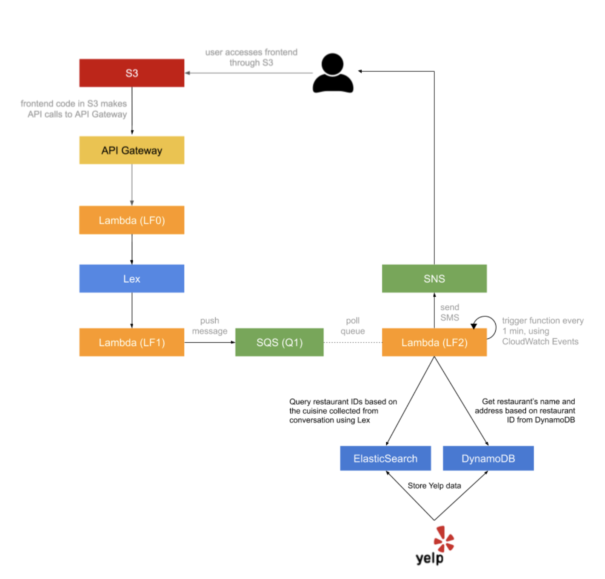

Dining Concierge Chat Bot

Customer Service is a core service for a lot of businesses around the world and it is getting disrupted at the moment by Natural Language Processing-powered applications. In this first assignment you will implement a serverless, microservice-driven web application. Specifically, a Dining Concierge chatbot that sends you restaurant suggestions given a set of preferences that you provide the chatbot with through conversation.

